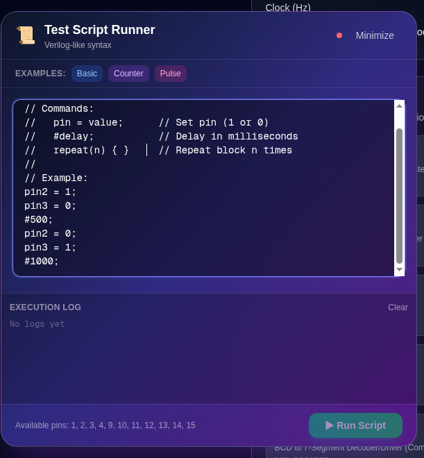

# Digital Lab Kit (v4)

A comprehensive hardware-software ecosystem for real-time integrated circuit (IC) testing, truth table verification, and remote laboratory monitoring.

---

## Project Technologies

[](https://nextjs.org/)
[](https://www.typescriptlang.org/)
[](https://expressjs.com/)
[](https://mqtt.org/)
[](https://isocpp.org/)
[](https://platformio.org/)

---

## Overview

**Digital Lab Kit** is an engineering-grade IC verification and remote monitoring platform that integrates modern web technologies, network-bridged communication systems, and microcontrollers. Designed for educational institutions and engineering laboratories, it supports:

1. **Direct Local Verification**: Real-time interaction via browser client using the **Web Serial API** or **Web Bluetooth (BLE)**.
2. **Distributed Remote Control**: Decentralized testing and diagnostics enabled by an Express-backed **MQTT to HTTP/SSE Bridge**.
3. **Automated Verification**: Batch execution of test sequences via a custom scripting engine.

---

## User Interface

| IC Selection Interface | Interactive Pin Visualizer |
| :---: | :---: |
|  |  |
| **Real-Time Monitoring Dashboard** | **Automated Scripting Editor** |
|  |  |

---

## Key Features

### Connectivity Matrix
* **Web Serial API**: Driverless, direct USB connection from Chromium-based web browsers to the target microcontroller.
* **Web Bluetooth (BLE)**: Wireless instrumentation control from mobile devices and BLE-compatible computers.
* **API Gateway Bridge (HTTP/SSE)**: A secure backend server proxies MQTT communications, shielding client browsers from broker complexities, improving performance, and enabling real-time Server-Sent Events (SSE).

### Logic Verification and Analysis
* **Extensive IC Library**: Pre-configured profiles for over 100 digital logic ICs, including logic gates, decoders, shift registers, multiplexers, counters, and arithmetic circuits.
* **Truth Table Verification**: Automated loop testing of IC operations against theoretical specifications with precise PASS/FAIL telemetry.
* **Interactive Pin Visualizer**: Dynamic visual representation of VCC, GND, Inputs, Outputs, and Clock status.
* **Non-Blocking Clock Generator**: Multi-channel configurable clock frequencies to verify sequential digital logic.
* **Scripted Test Automation**: High-level scripting compiler for programming test sequences with defined microsecond/millisecond delays and repeat loops.

### User Interface Design
* Built with **Next.js 15**, **TypeScript**, and **Tailwind CSS**.
* Designed using responsive layouts, theme persistence, and smooth animations powered by **Framer Motion**.

---

## Architecture

```
┌─────────────────────────────────────────────────────────────┐
│                    Frontend (Next.js 15)                     │
│  ┌──────────────┐  ┌──────────────┐  ┌──────────────┐     │
│  │   v2 Page    │  │ Monitor Page │  │  API Proxy   │     │
│  │ (IC Tester)  │  │  (Remote)    │  │   Routes     │     │
│  └──────┬───────┘  └──────┬───────┘  └──────┬───────┘     │
│         │                  │                  │             │
│         └──────────────────┴──────────────────┘             │
│                            │                                │
│                   ┌────────▼─────────┐                      │
│                   │  useAPIBridge    │                      │
│                   │  - SSE Stream    │                      │
│                   │  - HTTP Polling  │                      │
│                   │  - Publishing    │                      │
│                   └────────┬─────────┘                      │
└────────────────────────────┼──────────────────────────────┘
                             │
                   ┌─────────▼──────────┐
                   │  Next.js API Proxy │
                   │  /api/proxy/*      │
                   │  /api/events (SSE) │
                   └─────────┬──────────┘
                             │ (Server-Side HTTP)
                   ┌─────────▼──────────┐
                   │  Backend Server    │
                   │  (Express + MQTT)  │
                   │  Port 3001         │
                   └─────────┬──────────┘
                             │ (MQTT ws://)
                   ┌─────────▼──────────┐
                   │   MQTT Broker      │
                   │  ws://broker:9001  │
                   └─────────┬──────────┘
                             │ (MQTT client / BLE)
                   ┌─────────▼──────────┐
                   │  Hardware Nodes    │
                   │  (ESP32/Arduino)   │
                   │  - Serial Protocol │
                   │  - MQTT/BLE Client │
                   └────────────────────┘
```

---

## Directory Structure

```filepath
DigitalLabKit/
├── backend/                   # Express backend proxy for HTTP REST & SSE to MQTT
│   ├── server.js              # Express app & MQTT client bridge
│   ├── package.json           # Backend dependencies (express, mqtt, cors)
│   └── README.md              # Backend detailed setup and API reference
│
├── FrontEnd/digitalkit/       # Next.js 15 Client Web Application
│   ├── app/                   # App Router (pages: /v2, /monitor, /firmware-uploader)
│   ├── public/                # Static public assets
│   ├── package.json           # Frontend packages (framer-motion, lucide-react)
│   ├── API_BRIDGE_README.md   # Client Hook & UI Panel documentation
│   └── PROXY_ARCHITECTURE.md  # Detailed routing & security diagrams
│
├── ArduinoUnoNode/            # Arduino Uno firmware (16-pin support)
│   ├── src/main.cpp           # Strict binary serial protocol handler
│   └── platformio.ini         # PlatformIO toolchain settings for Atmega328p
│
├── ArduinoMegaTest/           # Arduino Mega firmware (16-pin support)
│   └── src/main.cpp           # Nextion display UART, WS2812 status LED, & Button controllers
│
├── DHTESP32/                  # ESP32 firmware implementation
│   └── src/main.cpp           # BLE Server, Nextion UART driver, and Serial controller
│
├── NEXTION with ESP32/        # Alternate ESP32 build
│   └── src/main.cpp           # Refined Bluetooth Low Energy + Nextion interface
│
├── Esp_test_1_Jun3/           # Safe GPIO mapping experiment for ESP32
│   └── src/main.cpp           # Button-to-pin mapping logic and debouncing
│
├── HMI/                       # Nextion design assets
│   ├── esp32.HMI              # Nextion Editor project file
│   └── esp32.tft              # Compiled flash image for the Nextion screen
│
└── MQTT_TOPICS.md             # API messages, payloads, and MQTT topic directory
```

---

## Communication Protocols and API Reference

### 1. Hardware Binary Frame Protocol
Used for low-latency, deterministic serial communication over USB or Bluetooth.

**Frame Structure:**
`[START_BYTE (0xAA)] [COMMAND_BYTE] [PAYLOAD_LENGTH] [PAYLOAD_BYTES...] [CHECKSUM]`

* **Checksum Formula:**
  $$\text{Checksum} = 0\text{xFF} - ((\text{Command} + \text{Length} + \sum\text{Payload Bytes}) \ \& \ 0\text{xFF})$$

| Command Byte | Name | Direction | Payload Description |
| :--- | :--- | :--- | :--- |
| **`0x01`** | `SET_ROLE` | Host ➔ Node | `[pin_index, role_code]` |
| **`0x02`** | `SET_LEVEL` | Host ➔ Node | `[pin_index, level_value (0 or 1)]` |
| **`0x03`** | `CLK_CONFIG` | Host ➔ Node | `[on_time_low, on_time_high, off_time_low, off_time_high]` (16-bit ms) |
| **`0x04`** | `CLK_ENABLE` | Host ➔ Node | `[enable_status (0 or 1)]` |
| **`0x05`** | `RESET` | Host ➔ Node | None (reinitializes all pins to unused) |
| **`0x06`** | `SYNC_REQUEST` | Host ➔ Node | None (forces node to dump full pin config) |
| **`0x07`** | `STATUS_REQUEST`| Host ➔ Node | None (forces node to return immediate pin status) |
| **`0x80`** | `ACK` | Node ➔ Host | `[ref_cmd, status_code]` |
| **`0x81`** | `STATUS_FRAME` | Node ➔ Host | `[millis_low8, packed_pin_states...]` (4-bit role + 1-bit value) |
| **`0x82`** | `SYNC_DUMP` | Node ➔ Host | `[num_pins, pin0_role, pin0_level, pin1_role, pin1_level...]` |

* **Role Codes:**
  `0 = INPUT`, `1 = OUTPUT`, `2 = GND`, `3 = VCC`, `4 = UNUSED`, `5 = CLOCK`

---

### 2. MQTT Broker Topic Schema
All connected clients subscribe and publish to topics matching the configured session base topic (default: `digitalkit/pins`).

* **Metadata Topic (`digitalkit/pins/<ic-slug>`)**
  * **Payload (JSON):**
    ```json
    {
      "partNumber": "7402",
      "description": "Quad 2-Input NOR Gate",
      "pinCount": 14,
      "category": "LOGIC_GATE",
      "inputPins": [2, 3, 5, 6, 8, 9, 11, 12],
      "outputPins": [1, 4, 10, 13],
      "powerPins": { "vcc": 14, "gnd": 7 }
    }
    ```
* **Pin Collections Topic (`digitalkit/pins/inputs` & `digitalkit/pins/outputs`)**
  * **Payload:** JSON array of pin numbers: `[2, 3, 5, 6, 8, 9, 11, 12]`
* **Individual Pin State (`digitalkit/pins/pin/<pin_number>`)**
  * **Payload:** `"0"` (LOW) or `"1"` (HIGH)

---

### 3. API Bridge REST Endpoints

* **`GET /health`**
  * Returns Express server runtime status and MQTT connection state.
* **`GET /events`**
  * Opens a Server-Sent Events (SSE) stream returning live broker updates.
* **`POST /api/metadata`**
  * Publishes IC specifications and metadata JSON to the broker.
* **`POST /api/pin-level`**
  * Publishes individual pin level adjustments.
* **`POST /api/pin-collections`**
  * Sets current input and output groupings.

---

## Hardware Integration and Pin Configuration

### Pin Mapping Strategy
Hardware nodes expose a logical pin block mapping physical GPIOs safely to the IC pins under test.

#### Arduino Mega Mapping
```
Logical Pin:  1   2   3   4   5   6   7   8   9  10  11  12  13  14  15  16
Mega Pin:    22  24  26  28  30  31  32  33  34  35  36  37  38  39  40  41
```

#### Arduino Uno Mapping
```
Logical Pin:  1   2   3   4   5   6   7   8   9  10  11  12  13  14  15  16
Uno Pin:     13  12  11  10   9   8   7   6   5   4  A0  A1  A2  A3  A4  A5
```

#### ESP32 GPIO Assignments
```
Safe GPIOs:  4, 5, 13, 14, 16, 17, 18, 19, 21, 22, 23, 25, 26, 27
Buttons:     32, 33, 34, 35, 36, 39
```

---

## Setup and Installation Guide

### Prerequisites
* **Node.js** v18 or later.
* **npm** or **yarn** package manager.
* **PlatformIO** (VS Code extension or CLI) for flashing firmware.
* **Google Chrome / Microsoft Edge** (for Web Serial and Web Bluetooth support).

### 1. Clone & Install Dependencies
```bash
# Clone the repository
git clone https://github.com/SshgurkiratSingh/DigitalLabKit.git
cd DigitalLabKit

# Install backend dependencies
cd backend
npm install

# Install frontend dependencies
cd ../FrontEnd/digitalkit
npm install
```

### 2. Configure Environment Files

Create a `.env.local` file inside `FrontEnd/digitalkit/`:
```env
NEXT_PUBLIC_API_BACKEND_URL=http://localhost:3001
```

Create a `.env` file inside `backend/`:
```env
PORT=3001
MQTT_BROKER_URL=ws://98.93.38.49:9001/mqtt
```

### 3. Spin up the Stack

```bash
# Start backend server (Terminal 1)
cd backend
npm run dev

# Start frontend application (Terminal 2)
cd FrontEnd/digitalkit
npm run dev
```

Visit the pages in your browser:
* **Interactive IC Tester Workspace:** `http://localhost:3000/v2`
* **Remote Monitor & Control Panel:** `http://localhost:3000/monitor`
* **Web Firmware Uploader:** `http://localhost:3000/firmware-uploader`

---

## Automated Scripting Interface

Automate sequential verification and trigger complex test patterns using the built-in Verilog-like test script engine.

### Script Syntax Rules
1. **Assignments:** Assign values to logical pins directly (e.g. `pin2 = 1;`).
2. **Delays:** Express time delays in milliseconds using the `#` symbol (e.g. `#1500;`).
3. **Loop Blocks:** Iterate sections using `repeat(N) { ... }`.

### Sample Shift Register Test Script
```verilog
// Initialize Reset and Data pins
pin1 = 0; // Clear register
#500;
pin1 = 1; // Release reset
#500;

// Shift in logical high values sequentially
repeat(4) {
  pin2 = 1; // Data Input HIGH
  pin11 = 1; // Generate Clock Rising Edge
  #200;
  pin11 = 0; // Clock Falling Edge
  #200;
}
```

---

## Contributing

Contributions are welcome. Please review the following steps:
1. **Fork** this repository.
2. Create a clean **feature branch** (`git checkout -b feature/AmazingFeature`).
3. **Commit** your changes with clear descriptions (`git commit -m 'Add some AmazingFeature'`).
4. **Push** to the branch (`git push origin feature/AmazingFeature`).
5. Open a **Pull Request** detailing your modifications.

---

## License

This repository is distributed under the Educational Community License for digital logic design learning. All data, designs, and firmware are open to modification for laboratory or classroom environments.

---

**Developed as an open-source educational platform for digital logic testing and validation.**
